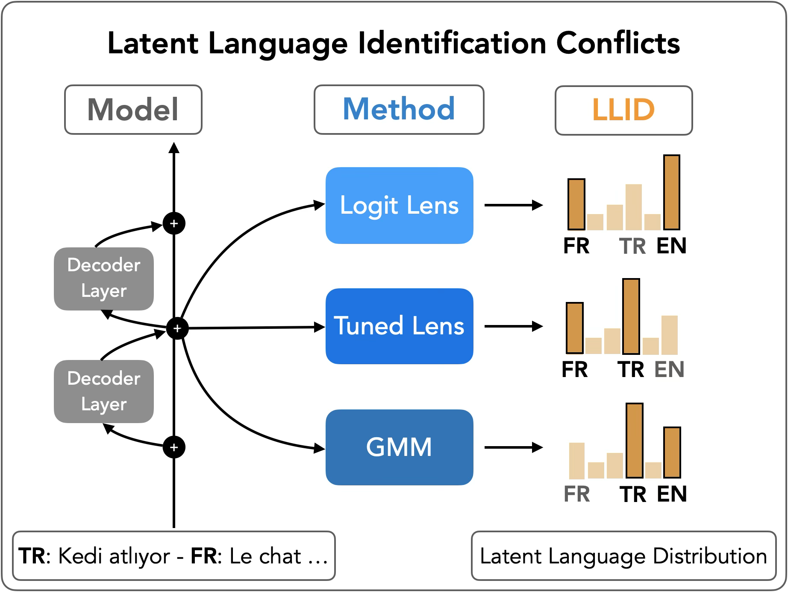

# Latent-LID: Lingua Franca or Probing Artifact?

This codebase is the implementation of the paper *"Lingua Franca or Probing Artifact? Rethinking Latent Language in Multilingual LLMs"*.

**Paper:** [https://arxiv.org/abs/2609.00155](https://arxiv.org/abs/2609.00155)

<p align="center">
    
    <br>
    <em>Figure 1: Do multilingual LLMs work in English? It depends on how you ask.</em>
</p>

> We probe the same intermediate hidden states of a multilingual LLM with three probes: logitlens, tuned lens, and a representation-based GMM, and recover three different latent language distributions over the task’s languages (TR, FR), and other candidate languages like English (EN). We study when and why these probes disagree across models, training regimes, and tasks.

## Table of Contents

- [Setup](#setup)
- [Repository Structure](#repository-structure)
- [Usage](#usage)
- [Supported Models](#supported-models)
- [Supported Languages](#supported-languages)
- [Bugs or Questions](#bugs-or-questions)
- [Related Codebases](#related-codebases)
- [Citation](#citation)

## Abstract

Latent language identification is often used to argue that multilingual language models route computation through language-specific states, such as English pivots. However, existing probes infer latent language from different signals, such as the geometry of hidden states or what can be decoded from intermediate representations.
Since such claims shape conclusions about how models share and route information across languages, we ask whether these probes measure the same phenomenon or expose distinct aspects of multilingual computation. 
We study this question across model families, training regimes, domains, tasks, checkpoints, and up to 27 languages. We find that identification probes systematically disagree: the GMM-based representation probe, which draws evidence from hidden state geometry, shows earlier cross-lingual mixing, whereas decoding-based probes, which rely on output-space decodability, retain sharper language-specific and more English-biased signals. These differences track model multilinguality and training progression, but are comparatively stable across domains. 
Our results suggest a more cautious interpretation of latent language identification, where current probes expose different aspects of multilingual processing, rather than directly revealing a single internal *lingua franca*.

## Setup

### Requirements

Tested with Python 3.10.12. Our experiments ran in a Docker environment based on `nvidia/cuda:12.0.0-runtime-ubuntu22.04`, using 1 × NVIDIA A100 80GB GPU.

Install the Python dependencies with:
```shell
# cd into the repo first
conda create -n llidvenv python=3.10.12
conda activate llidvenv
pip install -r requirements.txt
```

### Data

To run the evaluations, download the prepared data from the repository root:

```shell
wget -O llid-data-runtime.zip \
  https://github.com/bayazitdeniz/latent-lid/releases/latest/download/llid-data-runtime.zip
unzip -n llid-data-runtime.zip
# To overwrite files that already exist, use:
# python -m zipfile -e llid-data-runtime.zip .
```
The archive contains the `data/` directory, so its contents are extracted directly into the expected locations.

The build-time data is optional. It contains the source inputs and intermediate files used to create the prepared runtime data. You do not need it to run the evaluations.
```shell
wget -O llid-data-buildtime.zip \
  https://github.com/bayazitdeniz/latent-lid/releases/latest/download/llid-data-buildtime.zip
unzip -n llid-data-buildtime.zip
# To overwrite files that already exist, use:
# python -m zipfile -e llid-data-buildtime.zip .
```

If you want to rebuild individual datasets from their original sources, use the following scripts:

| Data source | Used for | Location | Script | Size |
| --- | --- | --- | --- | --- |
| Controlled target-string data | Copy, cloze, and translation Start(w) experiments | `data/wendler_2024_data/common69/` | `build_translation_pairs_and_filter.py`, `build_and_merge_tasks.py` | Full 27-language data: 1,863 copy, 1,863 cloze, and 48,438 directed-pair translation prompts; launchers select the smaller paper subsets |
| PUD splits | Open-ended PUD evaluations and GMM calibration | `data/pud_holdout/` | `scripts/data/build_pud.sh` | 21 languages, 100 train + 100 held-out test prompts per language |
| UD extension splits | Optional non-parallel language extension for PUD-style runs | `data/ud_holdout/` | `scripts/data/build_ud.sh` | 6 languages, 100 train + 100 held-out test prompts per language |
| FineWeb/FineWeb2 | Tuned-lens fitting | `data/fineweb_lens_27lang_55m/` | `scripts/data/build_fineweb.sh` | 27 languages; 4,096,000 train, 1,024,000 validation, and 1,024,000 test tokens per language |
| INCLUDE | Open-ended QA/domain evaluations and multilingual capacity baselines | `data/include_10lang_3domain_*` | `scripts/data/build_include.sh` | cap30: 882 prompts; all: 3,381 prompts |

## Repository Structure

The main repository structure is shown below. Experiment outputs, cached artifacts, and metrics are stored under `logs`.

```shell
.
# folders
├── scripts/             # experiment and repository automation
│   ├── data/            # dataset builders
│   ├── runs/            # local experiment launchers
│   ├── runai/           # matching RunAI launchers
│   ├── tools/           # batch-size, checkpoint, and analysis tools
│   └── validation/      # cleanup smoke tests and artifact comparison
├── data/                # data
├── figs/                # visualizations
├── logs/                # experiment outputs (config + artifacts + metrics)
├── notebooks/           # jupyter notebooks for experiment analyses
├── tests/               # unit tests
# files
├── fit_gmm.py               # representation-based GMM fitting
├── fit_tuned_lens.py        # decoding-based tuned lens fitting
├── lenses.py                # logit-lens and unembedding utilities
├── lid.py                   # language-identification backends
├── decode_then_classify.py  # decode-then-classify scoring
├── target_string.py         # target-string scoring
├── representation.py        # representation-based LLID utilities
├── run_eval.py              # main entrypoint
├── run_eval_utils.py        # utilities for main entrypoint
├── metrics.py               # evaluation metrics
├── utils.py                 # utilities
├── vis.py                   # visualization utilities
├── README.md                
└── requirements.txt         
```

## Usage

### Evaluation modes

The code supports two ways of estimating latent language from an intermediate model layer:
- **`q_dec` (decoding-based LLID)** asks what language can be decoded from the model's hidden state. For controlled tasks, it uses the model's token probabilities. For open-ended tasks, it generates text and identifies its language.
- **`q_repr` (representation-based LLID)** asks which language-specific hidden-state patterns the model's hidden state most resembles. In this repository, this is measured with a fitted GMM.

The two methods use different evidence, so they do not necessarily give the same answer. This disagreement is one of the main questions studied in the paper. Here, a *hidden state* simply means the model's internal representation at a particular layer.

| Aspect | `q_dec` (decoding) | `q_repr` (representation) |
|-------|------------------|-------------------------|
| What it uses as evidence | LM output softmax for controlled target-string runs, or generated text classified by language ID for open-ended runs | GMM posterior |
| How languages are identified | Controlled task target strings, or the labels returned by the language-ID backend | GMM per language |
| Used in the paper as | `target_string` with Start(w), plus `decode_then_classify` rollouts | `repr` with fitted GMM artifacts |
| Position where it is measured  | Controlled Start(w) anchor or rollout anchor | Single token, subset of tokens, or all tokens depending on `--repr-unit` / `--repr-token-agg` |
| Requires | Tokenizer-specific target-string artifacts or language-ID classifier outputs | Calibration text and fitted GMM artifacts |

For decoding-based LLID (`q_dec`), there are two main ways to turn model outputs into language scores.

```text
decoding_mapping
│
├── target_string                      # score known target answers
│   ├── start_tokens_only              # paper method: Start(w)
│   └── multi_token_teacher_forced     # optional full-sequence scoring
│
└── decode_then_classify               # generate text, then classify its language
    ├── rollout_argmax                 # argmax decoding
    └── rollout_sample                 # sampled decoding
```

- **`target_string`** is used when the expected answer is known. The paper uses `start_tokens_only` (Start(w)), which sums the next-token probability assigned to tokens that can begin the expected answer in each candidate language. `multi_token_teacher_forced` is an optional alternative that scores the full known answer sequence. It is not used for the paper's reported target-string results.
- **`decode_then_classify`** is used for open-ended tasks. It generates a short continuation from an intermediate layer and then uses a language-ID classifier to determine its language. The continuation can use either argmax decoding or sampling.

### Complete experiment run flow

Each paper experiment family has a local launcher in `scripts/runs/` and, where applicable, a matching RunAI launcher in `scripts/runai/`. Both use the same experiment settings and commands. Local launchers run configurations **sequentially**, while RunAI launchers submit **one job per configuration**.

Each main `runai_X.sh` therefore has a matching `run_X.sh`, except for the scheduler-only lm-harness waves wrapper. Local-only utilities, such as `run_pud_bpb.sh`, do not need a scheduler version.

The complete workflow is:

1. Download or build the required data from the Data section.
2. Measure model multilingual capacity with upstream INCLUDE and PUD BPB.
3. Find safe GMM and tuned-lens batch sizes if you are running on new hardware.
4. Fit representation GMMs and tuned lenses.
5. Run the controlled, PUD, INCLUDE, and training-dynamics evaluations.
6. Use the notebooks to select the paper runs from `logs/` and reproduce the figures.

| Purpose | Local launcher | RunAI launcher |
| --- | --- | --- |
| Find safe GMM batch sizes | `scripts/runs/run_auto_gmm_batch.sh` | `scripts/runai/runai_auto_gmm_batch.sh` |
| Fit final-checkpoint GMMs | `scripts/runs/run_fit_gmm.sh` | `scripts/runai/runai_fit_gmm.sh` |
| Fit GMMs across training | `scripts/runs/run_fit_gmm_across_revisions.sh` | `scripts/runai/runai_fit_gmm_across_revisions.sh` |
| Find safe tuned-lens batch sizes | `scripts/runs/run_auto_tuned_lens_batch.sh` | `scripts/runai/runai_auto_tuned_lens_batch.sh` |
| Fit tuned lenses | `scripts/runs/run_fit_tuned_lens.sh` | `scripts/runai/runai_fit_tuned_lens.sh` |
| Controlled Start(w) evaluations | `scripts/runs/run_controlled.sh` | `scripts/runai/runai_controlled.sh` |
| PUD evaluations | `scripts/runs/run_pud.sh` | `scripts/runai/runai_pud.sh` |
| INCLUDE evaluations | `scripts/runs/run_include.sh` | `scripts/runai/runai_include.sh` |
| Training dynamics | `scripts/runs/run_training_dynamics.sh` | `scripts/runai/runai_training_dynamics.sh` |
| Upstream INCLUDE zero-shot | `scripts/runs/run_include_lm_harness.sh` | `scripts/runai/runai_include_lm_harness.sh` |
| All INCLUDE lm-harness task groups | `scripts/runs/run_include_lm_harness.sh` with `TASK_GROUPS` | `scripts/runai/runai_include_lm_harness_waves.sh` |
| PUD21+UD6 BPB | `scripts/runs/run_pud_bpb.sh` | — |

By default, the launchers use the experiment settings selected by the paper notebooks:

- GMM fitting covers `pud9`, `pud9_ud6`, `pud21`, `pud21_ud6`, and the English-inclusive `include_10lang_en` setup.
- Tuned lenses use the 27-language FineWeb/FineWeb2 corpus. W&B logging is enabled by default; set `WANDB=0` to disable it. FineWeb artifacts are written below `logs/tuned_lens_fineweb27/`.
- Controlled runs cover copy, cloze, and seven target-specific translation runs using Start(w) target-string scoring over `data/wendler_2024_data/common69`.
- PUD runs evaluate representation and raw-logit-lens methods on all four PUD setups. Tuned-lens runs default to the main-paper `pud21_ud6` setup.
- INCLUDE runs default to the capped subset. Both INCLUDE data variants retain English as a candidate language and use `include_10lang_en` for representation runs; select the uncapped subset with `DATA_SOURCE=include_10lang_3domain_all`.
- Training dynamics uses the token-aligned Apertus-8B and OLMo-2 checkpoint lists in `checkpoint_lists/token_aligned_10/`.

To run only part of the default experiment set, use variables such as `MODELS`, `DATA_SOURCES`, `GMM_SETUPS`, and `DECODING_MODES`. The controlled launcher also supports `COPY_MODELS`, `CLOZE_MODELS`, and `TRANSLATION_MODELS`. Set `DRY_RUN=1` to print the commands that would run without executing them:

```shell
DRY_RUN=1 MODELS=swiss-ai/Apertus-8B-2509 \
  bash scripts/runs/run_pud.sh
```

Before a RunAI submission, set both the container image and the persistent-volume claim with its mount point inside the container:

```shell
RUNAI_IMAGE="<registry>/<image>:<tag>" \
RUNAI_PVC_MOUNT="<claim>:<container-path>" \
  bash scripts/runai/runai_pud.sh
```

The cluster pulls the image as the workload starts, so submission cannot guarantee that an image exists or that private-registry credentials are valid. If a submitted workload does not start, inspect its image-pull and scheduling events with `runai workload describe <job-name>`.

The launchers use the defaults in the Python entrypoints and `configs/default.json`. They only pass an argument when the paper settings or an explicit environment override changes that default. After editing the launchers, you can check their pairing and shell syntax with:

```shell
bash scripts/validation/check_launcher_pairs.sh
```

### Running a single evaluation

Use the launchers above to reproduce paper experiments. For a one-off test or debugging, `run_eval.py` evaluates one model revision at a time. It automatically loads `configs/default.json`, and command-line arguments override those defaults.

Representation-based runs require a fitted GMM. The available GMM setups and their artifact locations are defined in `configs/gmm_setups.json`. Decoding-based tuned-lens runs look for fitted lens files under `logs/tuned_lens_fineweb27/<sanitized_model>/<revision>/` by default. Use `--tuned-lens-root` to point to a different artifact tree, or `--tuned-lens-dir` to give an exact directory. Run `python run_eval.py --help` to see all available options.

Each evaluation is stored in `logs/evals/<exp-id>/`, including its resolved configuration at `logs/evals/<exp-id>/config.json`. 

For example, this runs the default decoding evaluation for GPT-2 on a single PUD example:
```shell
python run_eval.py \
  --model-name gpt2 \
  --data-source pud21 \
  --max-prompts 1
```

### Multilingual capacity measurements

The paper uses three external measurements of model multilingual capability, produced by two launchers:

- **INCLUDE zero-shot macro accuracy:** question-answering accuracy over 44 language groups, computed with `scripts/runs/run_include_lm_harness.sh` using `lm_eval`.
- **PUD21 line NLL:** mean teacher-forced line negative log-likelihood on the parallel PUD21 rows, computed by `scripts/runs/run_pud_bpb.sh`; lower is better.
- **PUD21+UD6 BPB:** corpus likelihood normalized by UTF-8 byte count over the combined PUD21+UD6 corpus, also computed by `scripts/runs/run_pud_bpb.sh`; lower is better.

The default INCLUDE launcher uses the **zero-shot** setting, where the model receives no examples in the prompt. The analysis also includes two **five-shot** settings, with five examples provided in either English or the original language. `runai_include_lm_harness_waves.sh` submits all three settings in waves of three jobs, waiting 15 minutes between waves to avoid Hugging Face dataset API rate limits. To run the same settings locally, set `TASK_GROUPS="include_base_44 include_base_44_few_shot_en include_base_44_few_shot_og"` when invoking `run_include_lm_harness.sh`.

For PUD21 line NLL, use only rows where `source == "pud"` because these form the parallel cross-language corpus. For PUD21+UD6 BPB, use the full corpus; the UD6 rows broaden language coverage but are not parallel across languages.

## Supported Models

| Model | Approx. multilingual profile | Notes |
| --- | ---: | --- |
| `gpt2` | Very low | GPT-2 is heavily English-centered; use as an English-dominant baseline. |
| `gpt2-xl` | Very low | Same family, larger but not meaningfully multilingual by design. |
| `allenai/OLMo-2-1124-7B` | Low | English-centric open base model; released intermediate checkpoints are used for the training-dynamics analysis. ([Hugging Face][8]) |
| `meta-llama/Llama-2-7b-hf` | Low–medium | Some multilingual ability, but not designed as a strong multilingual model. |
| `meta-llama/Llama-3.1-8B` | Medium | Llama 3.1 officially supports English plus French, German, Hindi, Italian, Portuguese, Spanish, and Thai. ([GitHub][1]) |
| `meta-llama/Llama-3.1-8B-Instruct` | Medium | Instruction-tuned variant of Llama 3.1-8B with the same stated language coverage. ([Hugging Face][2]) |
| `mistralai/Mistral-Nemo-Instruct-2407` | Medium–high | Mistral says NeMo is particularly strong in English, French, German, Spanish, Italian, Portuguese, Chinese, Japanese, Korean, Arabic, and Hindi; tokenizer trained on 100+ languages. ([Mistral AI][3]) |
| `CohereLabs/aya-23-8B` | High | Aya 23 is explicitly a multilingual model serving 23 languages. ([Hugging Face][4]) |
| `utter-project/EuroLLM-9B` | High for Europe | Designed around all 24 official EU languages plus 11 additional languages; strong European focus. ([arXiv][5]) |
| `utter-project/EuroLLM-9B-Instruct` | High for Europe | Instruction-tuned variant of EuroLLM-9B with the same multilingual focus. ([NVIDIA NIM APIs][6]) |
| `swiss-ai/Apertus-8B-2509` | Very high breadth | Apertus is advertised as supporting 1000+ languages; its paper says it trained on over 1800 languages with about 40% non-English pretraining data. ([Hugging Face][7]) |
| `swiss-ai/Apertus-8B-Instruct-2509` | Very high breadth | Instruction-tuned variant of Apertus-8B-2509 with the same broad multilingual coverage. ([Hugging Face][7]) |

[1]: https://github.com/meta-llama/llama-models/blob/main/models/llama3_1/MODEL_CARD.md "llama-models/models/llama3_1/MODEL_CARD.md at main"
[2]: https://huggingface.co/meta-llama/Llama-3.1-8B "meta-llama/Llama-3.1-8B"
[3]: https://mistral.ai/news/mistral-nemo "Mistral NeMo | Mistral AI"
[4]: https://huggingface.co/CohereLabs/aya-23-8B "CohereLabs/aya-23-8B"
[5]: https://arxiv.org/abs/2506.04079 "EuroLLM-9B: Technical Report"
[6]: https://build.nvidia.com/utter-project/eurollm-9b-instruct/modelcard "eurollm-9b-instruct Model by Utter-project"
[7]: https://huggingface.co/swiss-ai/Apertus-8B-2509 "swiss-ai/Apertus-8B-2509"
[8]: https://huggingface.co/allenai/OLMo-2-1124-7B "allenai/OLMo-2-1124-7B"

## Supported Languages

The experiments use the following language sets:

| Setting | # Languages | Languages |
| --- | ---: | --- |
| PUD9 | 9 | Arabic (`ar`), Czech (`cs`), English (`en`), French (`fr`), Hindi (`hi`), Icelandic (`is`), Indonesian (`id`), Portuguese (`pt`), Spanish (`es`) |
| PUD21 | 21 | Arabic (`ar`), Russian (`ru`), Hindi (`hi`), Chinese (`zh`), Korean (`ko`), Japanese (`ja`), Indonesian (`id`), German (`de`), English (`en`), Icelandic (`is`), Swedish (`sv`), Spanish (`es`), French (`fr`), Galician (`gl`), Italian (`it`), Portuguese (`pt`), Czech (`cs`), Polish (`pl`), Turkish (`tr`), Finnish (`fi`), Thai (`th`) |
| UD6 extension | 6 | Ukrainian (`uk`), Bulgarian (`bg`), Serbian (`sr`), Urdu (`ur`), Persian (`fa`), Marathi (`mr`) |
| INCLUDE-10 | 10 | Arabic (`ar`), Spanish (`es`), Finnish (`fi`), French (`fr`), Hindi (`hi`), Indonesian (`id`), Portuguese (`pt`), Russian (`ru`), Turkish (`tr`), Chinese (`zh`) |
| Copy/cloze main-plot subset | 6 | Arabic (`ar`), Hindi (`hi`), Chinese (`zh`), Russian (`ru`), English (`en`), French (`fr`) |
| Translation | 9 | Arabic (`ar`), Spanish (`es`), Finnish (`fi`), French (`fr`), Hindi (`hi`), Indonesian (`id`), Russian (`ru`), Turkish (`tr`), Chinese (`zh`) |
| FineWeb/FineWeb2 tuned-lens fitting | 27 | PUD21 + UD6; Portuguese is stored as `pt_br` and mapped to FineWeb2's `pt` data |

The `pud9_ud6` and `pud21_ud6` settings add the six UD languages to the corresponding PUD set. The `include_10lang_en` GMM setup also has English as a candidate latent language, even though INCLUDE itself has no English prompts.

The prepared controlled translation data and Start(w) artifacts cover all 27 languages. The paper appendix reports the broader nine-target translation set shown above, while the default launcher and plotting notebooks use Arabic, English, French, Hindi, Russian, Turkish, and Chinese to keep the figures manageable. Figures that exclude English remove it from this seven-language set. Spanish, Finnish, and Indonesian remain available, but are not included in the current default launcher grid.

## Bugs or Questions

Note that this codebase is purely for the purpose of research and scientific experiments. We expect unknown bugs or issues caused by different package versions. If you encounter any problems when using the code or want to report a bug, you can open an issue. Please try to specify the problem with details so we can help you better and quicker! If you have any questions related to the code or the paper, feel free to email the corresponding authors.

## Related Codebases

This repository builds on [epfl-dlab/llm-latent-language](https://github.com/epfl-dlab/llm-latent-language) for the dataset. We thank its contributors for making their code available.

## Citation

If you use our method in your work, please cite our paper:

```bibtex
@misc{bayazit2026linguafranca,
      title={Lingua Franca or Probing Artifact? Rethinking Latent Language in Multilingual LLMs},
      author={Deniz Bayazit and Badr AlKhamissi and Antoine Bosselut},
      year={2026},
      eprint={2609.00155},
      archivePrefix={arXiv},
      primaryClass={cs.CL},
      url={https://arxiv.org/abs/2609.00155},
}
```
